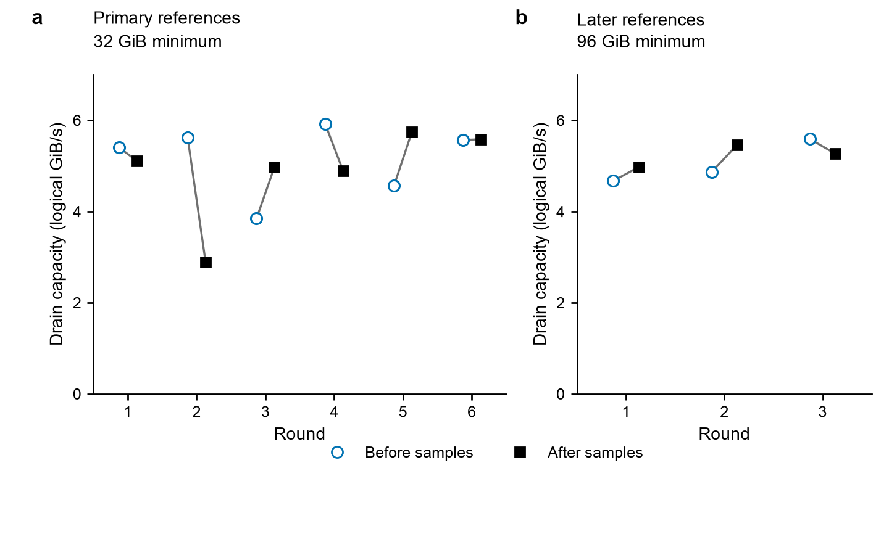

# Supporting Figure S1: reference drift

**Figure S1. Reference runs expose variation over the shard-count experiments.**
All before/after LZ4 reference runs at fifteen shards from the primary study
(a) and later adaptive follow-up (b). Each gray segment connects the
two reference observations bracketing one round of samples. Symbols are
separated horizontally within each round for visibility. Open circles are
before-sample measurements; black squares are after-sample measurements.
There is no aggregation or uncertainty interval in this figure. Primary
references use a 32 GiB logical-input minimum; later references use 96 GiB
and belong to a separate GPU job. Both use 64 KiB chunks, 16 KiB blocks,
bitshuffle, and append-through-close logical drain rates to shared NFS.
No reference correction is applied to the main sample rates.

[PDF](figure-s1.pdf) · [SVG](figure-s1.svg) ·
[Primary observations](data/shard-primary-reference-drift.csv) ·
[Later observations](data/shard-followup-reference-drift.csv)
