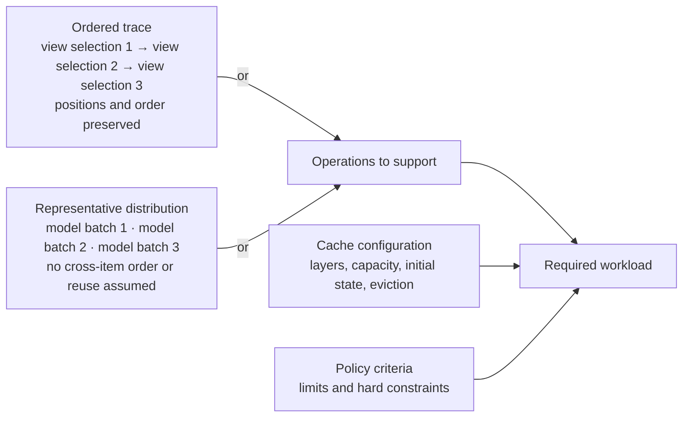

# Glossary

Archived snapshot, 2026-09-25. Retained for the earlier guide and planner.
The current article uses [the shorter glossary](../glossary.md);
this snapshot imposes no requirements on that article.

Canonical vocabulary for the guide, talk, figures, measurement report, and
layout planner. Prefer established Zarr and OME-Zarr terms. Terms introduced by
this project are labeled **project term**.

Exact specification keys, API names, code identifiers, and quoted source terms
may differ from the preferred prose. Write those exactly and format them as
code or identify them as source terminology.

Rules:

- Use one preferred term for one concept within a given context.
- Do not use an unqualified "chunk size" or "shard size". State chunk shape,
  shard shape, chunks per shard, raw chunk bytes, or stored shard bytes.
- Use `KiB`, `MiB`, `GiB`, and `TiB` for binary byte quantities.
- Give every project metric a formula, byte domain, aggregation scope, and unit.
- Prefer a concrete quantity over a new name when the quantity carries the
  argument by itself.
- Add only terms that affect a decision, are reused, or prevent a likely
  ambiguity. Ordinary words do not need glossary entries.

Primary terminology sources:

- [Zarr v3 core specification](https://zarr-specs.readthedocs.io/en/latest/v3/core/)
- [Zarr v3 regular chunk grid](https://zarr-specs.readthedocs.io/en/latest/v3/chunk-grids/regular-grid/)
- [Zarr v3 indexed sharding codec](https://zarr-specs.readthedocs.io/en/latest/v3/codecs/sharding-indexed/)
- [OME-Zarr 0.5 specification](https://ngff.openmicroscopy.org/0.5/)

## 1. Workloads and selections

- **selection**: the array indices requested by one read operation. Always name
  the selection form when it matters. Unless stated otherwise, this project
  models an axis-aligned rectangular selection described by an origin and a
  shape. Avoid using query, important read, requested unit, or operation as an
  interchangeable synonym.
- **cold selection**: a selection issued after every cache layer named in the
  cache configuration has been emptied or reset. Do not claim that unspecified
  operating-system, browser, proxy, CDN, or storage-service caches are cold.
- **ordered trace**: selections, batches, or writes in application order, with
  positions preserved. Include timing and concurrency when they can affect
  prefetch, expiration, eviction, or overlap. A workload trace is an acceptable
  generic description, but ordered trace names the ordered representation used
  here.
- **required workload** (**project term**): an ordered trace or representative
  distribution of independent selections, batches, or writes that a layout
  must support, together with its policy criteria and cache configuration. A
  use case is not a workload until these observable operations and requirements
  are stated.
- **viewport**: the visible display area of an interactive viewer.
- **view selection** (**project term**): the array region needed to render a
  viewport for a stated orientation, resolution level, channel set, and time
  point or interval. An XY plane is one view selection, not the definition of
  every viewport.
- **model sample shape** (**project term**): the fixed spatial and temporal
  extent, with a declared channel set, consumed by one model contract.
- **model sample**: one instance of a model sample shape at one position.
- **batch**: model samples loaded or evaluated together. State whether their
  positions are adjacent, overlapping, or dispersed.
- **independently selected axis** (**project term**): an axis for which every
  operation in a required workload selects one coordinate at a time. When
  discussing a chunk that spans several values on such an axis, state the
  extent directly, such as `T=4`; do not call it a packed chunk.
- **spatial locality**, **temporal locality**: established names for nearby
  accesses in space or time. Credit locality as a layout benefit only when the
  ordered trace shows reuse before eviction from a declared cache.

Relationship among the workload terms:

Each numbered view selection is one read operation. Each model batch contains
one or more model samples. The arrows in the ordered trace preserve application
order; they do not assert cache reuse. Reuse is credited only when the trace and
cache configuration demonstrate it.

When reporting a distribution, say **per selection** or **per batch** rather
than introducing a generic workload-sample unit.

## 2. Arrays, chunks, shards, and storage

- **array**: a Zarr array with one logical shape, data type, chunk grid, and
  codec pipeline. Use array, not dataset, when discussing one resolution level.
- **multiscale image**: the image and its ordered resolution-level arrays plus
  their OME-Zarr multiscale metadata.
- **dataset scope** (**project term**): the exact collection included in a
  dataset-wide count or byte total, such as one array, one multiscale image, one
  HCS plate, or one published store. State the scope before using dataset as a
  short form. Do not confuse it with the OME-Zarr `datasets` metadata key.
- **array layout**: the chunk grid, codec pipeline, and mapping to stored values
  for one array. This project varies chunk and shard shapes while holding or
  declaring the other layout properties.
- **multiscale layout**: the downsampling schedule and array layout at every
  resolution level. Use layout alone only after its scope is established.
- **chunk**: the independently encoded and decoded array block used by the
  reader-facing model. With the Zarr v3 indexed sharding codec, this corresponds
  to the specification's **inner chunk**. The outer chunk-grid cell is the
  shard. State this convention when moving between the guide and specification
  text.
- **chunk shape**: the declared extent of a chunk along every array axis. For a
  regular chunk grid, all chunks retain this shape even where the grid
  overhangs the array.
- **raw chunk bytes** (**project term**): for a fixed-size data type, element
  size times the product of the declared chunk shape. This is the decoded array
  representation size, not necessarily the input size at every later codec
  stage.
- **edge chunk**: a chunk whose grid cell overhangs the array boundary.
- **in-bounds chunk extent** (**project term**): the intersection of a chunk
  with the logical array. An edge chunk has a smaller in-bounds extent but
  retains the declared chunk shape and raw chunk bytes.
- **store**: a key-value storage backend containing Zarr metadata and encoded
  array data.
- **store key**, **stored value**: the key and byte value in the Zarr store. A
  stored value commonly maps to one filesystem file or one object-store object,
  but that mapping is store-dependent.
- **storage object**: one filesystem file or object-store object. Use this only
  when the deployment exposes that mapping. Short form: object.
- **shard**: with the Zarr v3 indexed sharding codec, an outer chunk-grid cell
  stored as one value and containing independently encoded inner chunks plus a
  shard index.
- **shard shape**: the extent of a shard along every array axis, measured in
  array elements. This is the chunk shape of the outer Zarr array described by
  the indexed sharding specification.
- **edge shard**, **in-bounds shard extent** (**project terms**): an edge shard
  is a shard whose outer chunk-grid cell overhangs the array. It retains its
  declared shard shape but has a smaller intersection with the logical array.
- **inner chunk shape**: the chunk shape configured inside the indexed sharding
  codec. In reader-facing text this project normally calls it chunk shape.
- **chunks per shard**: the per-axis integer quotient of shard shape divided by
  inner chunk shape. It is a tuple, not the shard shape. The inner chunk shape
  must evenly divide the shard shape on every axis.
- **shard index**: the per-shard table mapping each possible inner chunk to its
  encoded byte offset and length.
- **stored shard bytes** (**project term**): the byte length of one stored shard
  value, including encoded inner-chunk payloads, the shard index, and any outer
  codec framing or padding.
- **decoded shard bytes**: a DCA v0.2 source term for raw chunk bytes times the
  number of chunks per shard. Use it only while quoting or analyzing that rule;
  indexed sharding does not require decoding a whole shard.
- **range read**: a request for a specified byte interval of a stored value
  rather than the complete value.

## 3. Resolution levels and downsampling

- **multiscale pyramid**: the arrays representing one image at multiple
  resolutions. Short form: pyramid.
- **resolution level**: one array in a multiscale pyramid. Short form: level.
  OME-Zarr metadata calls the corresponding entries `datasets`; use that exact
  key only in metadata discussions. Avoid scale or level of detail as an
  interchangeable prose synonym.
- **base level**: the highest-resolution array, first in the ordered OME-Zarr
  `datasets` list. It is commonly called level 0 by implementations.
- **downsampling factor**: the per-axis reduction between adjacent resolution
  levels. The **cumulative downsampling factor** is relative to the base level.
  Do not confuse either with the physical sample spacing stored by an OME-Zarr
  `scale` coordinate transformation.
- **downsampling schedule**: the cumulative downsampling factors at every level,
  including which axes are reduced and when each axis stops being downsampled.
- **required coarsest level** (**project term**): the coarsest resolution level
  an application requires, specified by explicit criteria such as maximum array
  shape, minimum cumulative downsampling factors, or required physical sample
  spacing. It is independent of what a particular pyramid builder happens to
  emit.
- **coarsest emitted level** (**project term**): the last level actually
  produced by a pyramid builder.
- **per-axis stopping** (**project term**): stop downsampling each scheduled axis
  separately when it reaches its declared target, without inferring behavior
  from whether the axis is spatial, temporal, or in-plane. This is the preferred
  candidate-generation rule, not a conformance requirement.
- **coupled-axis stopping** (**project term**): downsample a declared group of
  axes together and stop the group when its stated stopping rule is met. Current
  Acquire Zarr couples X and Y; cite a pinned version when publishing that fact.
- **pyramid builder**: a component that produces resolution levels.
- **integrated pyramid builder** (**project term**): produces coarser levels as
  part of a single-pass conversion without rereading the completed base level.
- **batch pyramid builder** (**project term**): builds levels from an already
  written, randomly readable input array.
- **downsampling method**: the numerical kernel, boundary handling, and data-type
  behavior used to produce a coarser level. Record it for correctness; it is not
  itself a chunk or shard decision.

## 4. Byte ledger

Record these quantities for the same selection, batch, level, or dataset and
state that scope explicitly. These labels are project accounting terms; the
codec stages they name follow the Zarr codec pipeline.

- **useful logical bytes**: the uncompressed, in-bounds values requested by the
  application. Short form: useful bytes.
- **decoded chunk bytes**: the sum of the full decoded representations of the
  chunks that must be decoded to serve the selection. Short form: decoded bytes.
- **codec-stage bytes**: bytes at a named boundary in a codec pipeline. Name the
  boundary, such as compressor input, whenever an intermediate stage matters.
- **encoded chunk payload bytes**: the byte lengths of the final encoded
  representations of the required chunks before they are combined with a shard
  index. For indexed sharding, sum the `nbytes` entries for the required inner
  chunks. Short form: encoded payload bytes.
- **shard-index bytes**: encoded shard-index bytes read, written, or stored.
  State which operation is being counted.
- **transferred storage bytes**: encoded payload, shard-index bytes, coalescing
  gaps, and any whole-value over-read moved by storage read requests. Protocol
  headers are separate unless explicitly included.
- **raw logical bytes**: for a fixed-size data type, element size times the
  product of the logical array shape.
- **stored bytes**: final bytes present in the store for the declared scope,
  including encoded payload, indexes, and metadata. State whether storage-system
  overhead outside the Zarr store is included.
- **omitted fill chunks**: chunks absent from the store because the writer
  recognized that their logical values equal the fill value.
- **logical bytes represented by omitted fill chunks**: the sum of raw chunk
  bytes represented by omitted fill chunks. This is not measured storage
  savings; storage savings require encoding a counterfactual or a paired run.
- **payload bytes reread**, **payload bytes rewritten**, **index bytes
  rewritten**: update traffic at the named encoded-storage stage. Do not use
  unqualified bytes reread or bytes rewritten.

The existing schema field `zero_skipped_bytes` is implementation-specific and
must document whether it counts only zero-valued chunks, all fill-valued chunks,
and whether its byte count is logical or encoded.

## 5. Project metrics

These are project-defined analytical metrics, not Zarr specification terms.
Compute each ratio per selection or batch before reporting p50, p95, and maximum.
If a ratio of workload totals is also reported, label it separately.

- **decode amplification** = decoded chunk bytes / useful logical bytes. It
  isolates chunk-to-selection mismatch.
- **encoded fraction** = encoded chunk payload bytes / decoded chunk bytes for
  the same chunks. Lower is better. When using compression ratio from an
  external source, give its formula because both ratio directions occur.
- **storage over-read** = transferred storage bytes / encoded chunk payload
  bytes required for the selection. It isolates shard-index, coalescing, range,
  and whole-value effects. If no encoded payload is required, report the byte
  counts and mark the ratio not applicable.
- **transfer amplification** = transferred storage bytes / (useful logical bytes
  times encoded fraction). It equals decode amplification times storage over-read
  only when all three ratios use the same chunks and measured byte ledger. Call
  it **estimated transfer amplification** when encoded fraction is an estimate
  from another sample or dataset.
- **write amplification** = all storage bytes written for an update, including
  rewritten payload and index bytes, divided by the final encoded payload bytes
  corresponding to logically changed chunks. State any excluded metadata or
  storage-system writes.

Do not name stored bytes / raw logical bytes as codec efficiency. Report that
fraction directly when useful and explain that it includes compression, omitted
fill chunks, indexes, and metadata.

## 6. Requests, latency, and parallelism

- **storage read request**: one read operation issued by the client to the Zarr
  store after application-level coalescing. Short form: read request. Do not call
  it a physical read; one request need not correspond to one device I/O.
- **coalesced read**: adjacent or nearby encoded ranges combined into one storage
  read request. Report any gap bytes transferred by the merge as over-read.
- **time to first displayed pixel**: elapsed time from a cold view request until
  the application can render the first correct visible image data. This is a
  visualization requirement, not a throughput metric.
- **steady-state viewport latency**, **steady-state frame latency**: latency of
  later operations in a declared ordered trace and bounded cache configuration.
- **batch latency**, **samples per second**: modeling requirements.
- **time until a level is readable**: conversion time at which the stated
  readiness condition first holds for a resolution level. Define whether that
  condition requires metadata visibility, every chunk, final indexes, and a
  successful independent read.
- **distinct shards touched per selection or batch**: count of different shards
  intersected by one selection or batch. It bounds exposed shard-level work but
  does not prove concurrent I/O.
- **scheduling wave**: an implementation-defined group of operations issued
  together. Use only when describing that implementation's own unit.
- **shard parallelism target** (**project term**): the smallest number of
  concurrent independent shards that reaches within `throughput_tolerance` of
  measured peak throughput on the target system. A layout exposes enough shard
  work only when the relevant selections or batches touch at least this many
  independently schedulable shards.
- **exposed independent work**, **observed concurrency**: the first describes
  operations that could run independently; the second is measured overlap in
  the client, protocol, network, store, or device. Never use one as evidence of
  the other.

## 7. Caches

These are project names for cache layers. When a client uses different names,
record the mapping.

- **shard-index cache**: avoids repeated shard-index requests and bytes.
- **encoded-payload cache**: avoids repeated storage reads but not decoding.
- **decoded-chunk cache**: avoids both storage transfer and decoding at higher
  memory cost.
- **cache state**: the initial contents of each named cache layer. The project
  uses **cold**, **index-warm**, **payload-warm**, and **decoded-warm** only when
  the populated layers are listed explicitly.
- **cache configuration**: every cache layer in scope, its byte capacity, initial
  state, admission and eviction policy, and any expiration or prefetch policy.
  Also state how uncontrolled OS, browser, proxy, CDN, and service-side caches
  were handled.

## 8. Conversion and writing

- **producer**: the organization or pipeline responsible for publishing a
  dataset. Name which meaning applies when discussing normative obligations.
- **conversion path**: one pinned composition of source reader, metadata
  construction, pyramid builder, Zarr writer, and relevant versions.
- **source and metadata layer** (**project term**): the component that decodes
  the source format and constructs the OME-Zarr image or HCS hierarchy and
  metadata; this is iohub's role in the evaluated paths.
- **Zarr writer**: the library or component that creates or updates Zarr store
  values, such as Acquire Zarr, TensorStore, or zarr-python. Writer is an
  acceptable short form after the scope is clear. Preserve exact external API
  names such as ome-zarr-py's writer module.
- **write pattern** (**project term**): whether output regions are produced once
  and finalized or may be revisited. The earlier guide compares single-pass
  streaming and arbitrary-region writes. A pattern does not specify traversal
  order or identify the source data; it is distinct from a write workload.
- **write workload** (**project term**): the data-production task, its source,
  and its requirements. The current article considers streaming and rechunking.
- **streaming** (write workload): producing Zarr from a stream of images, either
  during acquisition or while converting a collection of TIFFs. Acquisition
  emphasizes sustained throughput; TIFF conversion emphasizes memory use.
  State input order and buffering rather than assuming a particular write
  pattern or memory bound from this label.
- **rechunking** (write workload): the Zarr-to-Zarr transformation considered in
  the current article, such as Zarr v2 to v3 conversion. Record source and
  destination formats, chunk/shard shapes, codecs, and processing order. A
  format-version change need not change chunk shape. Memory use includes both
  source reading and destination assembly. This is distinct from random
  subvolume writes, which are outside the article's scope.
- **single-pass streaming write**: each output region is produced once and is
  not revisited after it is finalized. State the traversal and finalization
  order required by the writer; single-pass does not itself mean monotonically
  increasing file offsets.
- **arbitrary-region write**: writes may target any output region, arrive in any
  traversal order, or revisit previously written data.
- **write order**: the traversal or arrival order of regions, such as source
  order, chunk-major, shard-major, or randomized. It is independent of whether
  regions may be revisited.
- **active shard**: a shard with buffered writer state or I/O in progress.
- **concurrent shards** (**project term**, streaming writes): the shards in
  the `D-1` dimensional layer currently receiving appended data. These shards
  are typically opened, written, and closed over the same interval. For a
  regular grid with one append axis `a`, the layer count is
  `product(ceil(array_shape[d] / shard_shape[d]))` over axes `d != a`.
  State the actual append traversal and geometry. This count is distinct from
  total shards, active writer state spanning layer transitions, worker count,
  and measured overlapping I/O. For reads, use distinct shards touched or
  measured active files with an explicit selection, batch, or time scope.
- **unfinished chunk**: a partially populated decoded chunk buffer not yet ready
  for final encoding.
- **writer working memory** (**project term**): memory attributable to writer
  queues, unfinished chunks, codec buffers, pyramid state, shard indexes,
  active-shard state, and retained payload. Measure or model its components
  explicitly.
- **process peak RSS**: the maximum resident set size of the complete process.
  It includes source readers, allocators, libraries, and unrelated state and is
  not a synonym for writer working memory.
- **source rate**: useful logical input bytes delivered per second.
- **encoding throughput**: decoded chunk bytes consumed by the measured codec
  pipeline per second. Also report encoded output bytes per second when useful.
- **decoding throughput**: decoded chunk bytes produced by the measured codec
  pipeline per second.
- **conversion throughput**: useful logical input bytes committed to the final
  dataset per second, end to end.
- **stored-byte throughput**: bytes committed to the store per second.
- **read-modify-write**: an update that reads existing encoded state, combines
  it with changed data, and writes replacement state. Report payload and index
  bytes reread and rewritten separately.

## 9. Policy and selection

- **policy criterion**: a reproducible pass/fail condition. A numeric bound is a
  **policy limit**; a structural requirement may instead be a hard constraint.
- **policy parameter**: a named input to a policy procedure. Its **policy value**
  is the assigned value.
- **unresolved policy parameter**: a parameter with a definition and measurement
  method but no supported value yet. Never replace it with small, large,
  reasonable, or similar language.
- **candidate layout**: a complete layout under evaluation for its declared
  scope. An array-layout candidate includes a chunk shape, shard shape, and
  other declared array-layout properties. A multiscale-layout candidate also
  includes the downsampling schedule and one array layout per resolution level.
  Use **chunk candidate**, **shard candidate**, or **downsampling candidate**
  for an incomplete component.
- **passing layout**: a candidate layout that satisfies every policy criterion.
  The collection of passing layouts is the **feasible set**.
- **Pareto frontier**: the passing layouts for which no other measured layout is
  at least as good on every named objective and better on at least one. State
  every objective and whether greater or smaller values are preferred.
- **tie-break**: the deterministic lexicographic ordering used to select among
  passing layouts.
- **compression tolerance** (`compression_tolerance`): allowed encoded-fraction
  excess relative to the best measured chunk candidate.
- **throughput tolerance** (`throughput_tolerance`): the improvement below which
  another step in a measured throughput sweep is treated as a plateau.
- **maximum shard count** (`N_max` in equations): maximum allowed shards for the
  declared array or dataset scope.
- **minimum efficient stored-value bytes** (**project term**): the smallest
  stored-value byte length beyond which increasing the byte length improves
  measured storage throughput by less than the throughput tolerance.
- **provenance class**: exact geometry, modeled estimate, project measurement,
  source-reported measurement, implementation fact, hypothesis, or policy
  choice. Every reported number carries one class plus its source or method.

## 10. Project artifacts

- **article**: the current, focused piece planned in `article-outline.md`;
  evidence collection is organized in `cluster-data-prompts.md`.
- **guide**: the document planned in `outline.md`.
- **talk**: the presentation planned in `presentation-outline.md`.
- **figures**: the Typst sources planned in `figure-outline.md`.
- **measurement plan**: `measurements.md`.
- **layout planner**, **layout explorer**: the executable and interactive front
  end in `code/`, designed in `planner-design.md`.
- **policy TOML**: the planner input file, for example
  `code/example-policy.toml`.
- **DCA review**: `dca-chunking-sharding-review-outline.md`, a separate
  deliverable that critiques DCA v0.2 and cites the guide.
- **layout decision record**: the per-dataset or per-recipe record of inputs,
  policy criteria, evidence, selected layout, and rejected alternatives.

## 11. Reference names

These descriptions are a reference inventory, not definitions of general
concepts. Pin a public URL, version, and commit before using an implementation
claim in reader-facing work.

- **Acquire Zarr**: the single-pass streaming Zarr writer with an integrated
  pyramid builder recommended for the corresponding conversion path. Local
  source: `~/src/acquire-zarr`.
- **Chucky**: temporary name of the next-generation Acquire Zarr backbone. Use
  when identifying source provenance and reporting its measured benchmark
  results. Do not attribute those results to another Acquire Zarr release
  without version evidence. Local source: `~/src/LANG/c/chucky`.
- **Damacy**: reader library whose planner coalesces ranges within a shard and
  interleaves work across shards. Local source: `~/src/LANG/c/damacy`.
- **Katamari**: an unresolved project reference. Do not use it in reader-facing
  text until its role and relationship to Damacy are documented.
- **Idetik**: CZI's web image viewer for OME-Zarr. Repository:
  <https://github.com/chanzuckerberg/idetik>.
- **Neuroglancer**: a WebGL-based volumetric-data viewer originally developed
  at Google. Repository: <https://github.com/google/neuroglancer>.
- **iohub**: CZ Biohub library providing microscopy readers and OME-Zarr/HCS
  construction. It can supply the source and metadata layer while delegating
  storage to a Zarr writer.
- **ngff-zarr**: batch pyramid builder using a Dask task graph and explicit
  per-axis downsampling factors.
- **ome-zarr-py**: OME's Python implementation and API for OME-Zarr data.
- **TensorStore**: Google's array-storage library, used here as an
  arbitrary-region Zarr writer in the earlier guide and as a reader in the
  current article's benchmark comparisons.
- **zarr-python**: the Zarr project's Python implementation, used here as an
  arbitrary-region Zarr writer.
- **bioformats2raw**: OME conversion software used by IDR and BIA. Any claim
  about its chunk choices must name a version.
- **DCA**: the Dynamic Cell Atlas array standard, currently referenced here as
  v0.2. Expand on first use and pin its repository version before publication.
- **IDR**, **BIA**: Image Data Resource and BioImage Archive.
- **NGFF**, **OME-Zarr**: NGFF is the community process for developing
  next-generation bioimaging formats; OME-Zarr is the format produced by that
  process, combining Zarr array storage with OME metadata.
- **HCS**: high-content screening; here, the OME-Zarr plate, well, and field
  hierarchy and associated metadata.
- **Zarr v3 indexed sharding**: the standardized `sharding_indexed` codec. Do
  not generalize this to a claim that every possible form of sharding requires
  Zarr v3.

## 12. Prose-to-schema mappings

Prose follows the terms above. Exact schema and code identifiers remain in code
font until a dedicated compatibility-preserving code migration is made.

| Preferred prose | measurements.md field | Current planner field |
|---|---|---|
| maximum shard count | `maximum_shard_count` | `storage.maximum_shards` |
| minimum efficient stored-value bytes | `minimum_efficient_stored_value_bytes` | `storage.minimum_efficient_object_bytes` |
| maximum stored shard bytes | `maximum_stored_shard_bytes` | `storage.maximum_shard_bytes` |
| compression tolerance | `compression_tolerance` | `search.compression_tolerance` |
| throughput tolerance | none | none |
| shard parallelism target | `shard_parallelism_target` | `workloads[].minimum_p05_distinct_shards` |
| maximum p95 decode amplification | `maximum_p95_decode_amplification` | `workloads[].maximum_p95_decode_amplification` |
| maximum p95 transfer amplification | `maximum_p95_transfer_amplification` | `workloads[].maximum_p95_transfer_amplification` |
| maximum p95 storage read requests per selection or batch | `maximum_p95_storage_read_requests` | `workloads[].maximum_p95_requests` |
| minimum encoding throughput | `minimum_encoding_throughput_bytes_per_second` | `search.minimum_encoding_throughput_bytes_per_second` |
| minimum conversion throughput | `minimum_conversion_throughput_bytes_per_second` | none |
| maximum writer working memory | `maximum_writer_working_memory_bytes` | `writer.maximum_memory_bytes` |
| maximum process peak RSS | `maximum_peak_rss_bytes` | none |
| maximum active shards | `maximum_active_shards` | `writer.active_write_shards` |
| required coarsest level | `required_coarsest_level` | not yet modeled |
| range reads available | none | `storage.range_reads` |
| shard-index cache state | none | `storage.index_cache` |
| encoded fraction estimate | measured | `estimates.encoded_fraction` |

Current code also uses `shard_shape_in_chunks` for the preferred prose concept
chunks per shard, `writer` for the Zarr writer configuration section, and
`model_patch` for a model-sample workload. Planner result fields also retain
`estimated_dataset_bytes`, `average_shard_bytes`, `maximum_shard_bytes`,
`requests`, and `compression_provenance`; their prose labels are estimated
stored array-data and shard-index bytes excluding metadata, estimated average
and maximum stored shard bytes, storage read requests, and encoded-fraction
provenance. Treat these as
implementation names, not alternate prose, until the code migration has a
compatibility plan.
